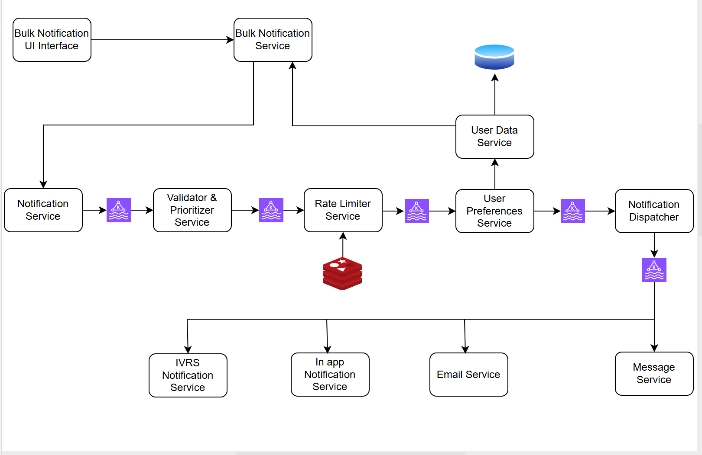
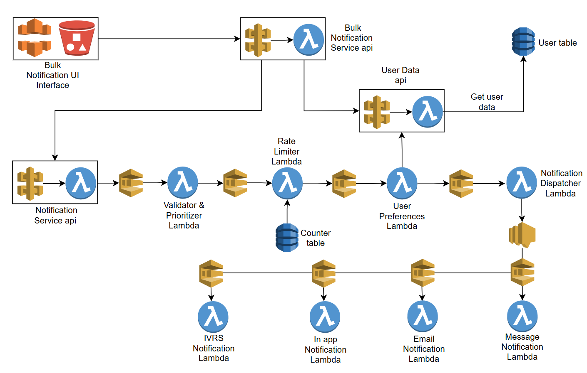

# NotifyHub

NotifyHub is a **production-grade, event-driven notification platform** built using **Quarkus and AWS serverless services**.  
It supports **real-time and bulk notifications** with **prioritization, rate limiting, user preferences**, and **multi-channel delivery** (Email, SMS, In-App, IVRS).

This project is designed to demonstrate **scalable system design**, **clean service boundaries**, and **cloud-native architecture** suitable for real-world production systems.

---

## 🛠️ Tech Stack

- **Framework**: Quarkus (supersonic, subatomic Java)
- **Language**: Java 17
- **Build Tool**: Maven
- **Infrastructure**: Terraform (Infrastructure as Code)
- **Cloud**: AWS Serverless (Lambda, API Gateway, DynamoDB, SQS, SNS)
- **Deployment**: Native compilation with GraalVM

## Getting Started

### Prerequisites
- Java 17 or higher
- Maven 3.8.2 or higher (or use Maven Wrapper)
- GraalVM (optional, for native compilation)
- Docker Desktop (for native builds on Windows)

### Maven Wrapper Setup

This project uses Maven Wrapper to ensure consistent Maven version (3.9.6) across all environments.

**If Maven wrapper JAR is missing, download it:**
```bash
# Windows
curl -o .mvn\wrapper\maven-wrapper.jar https://repo.maven.apache.org/maven2/org/apache/maven/wrapper/maven-wrapper/3.2.0/maven-wrapper-3.2.0.jar

# Unix/Linux/Mac
curl -o .mvn/wrapper/maven-wrapper.jar https://repo.maven.apache.org/maven2/org/apache/maven/wrapper/maven-wrapper/3.2.0/maven-wrapper-3.2.0.jar
```

**Or generate Maven Wrapper files from scratch:**
```bash
mvn -N wrapper:wrapper -Dmaven=3.9.6
```

This creates:
- `mvnw.cmd` (Windows)
- `mvnw` (Unix/Linux)
- `.mvn/wrapper/` directory

**After setup, use `mvnw` instead of `mvn`:**
```bash
# Windows
mvnw.cmd quarkus:dev

# Unix/Linux/Mac
./mvnw quarkus:dev
```

### Running the Application
```bash
# Development mode (hot reload)
mvnw.cmd quarkus:dev

# Production mode
mvnw.cmd quarkus:build
java -jar target/quarkus-app/quarkus-run.jar
```

The application will start on `http://localhost:8080`

### Building for AWS Lambda
```bash
# JVM mode
mvnw.cmd clean package

# Native mode (faster cold starts, uses Docker)
mvnw.cmd clean package -Pnative
```

### Infrastructure Deployment
```bash
# Initialize Terraform
cd infrastructure
terraform init

# Plan deployment
terraform plan

# Deploy infrastructure
terraform apply

# Destroy infrastructure
terraform destroy
```

---

## 🚀 Key Features

- **Event-driven architecture** using SQS and SNS
- **Serverless-first design** (API Gateway, Lambda, DynamoDB)
- **Real-time & bulk notifications**
- **Priority-based processing**
  - High priority (OTP / critical alerts)
  - Low priority (promotional messages)
- **Rate limiting**
  - Per user / per client
  - Priority-aware throttling
- **User preference management**
  - Channel-level preferences
- **Multi-channel delivery**
  - Email
  - SMS
  - In-App
  - IVRS
- **Highly scalable & fault-tolerant**
- **AWS Free Tier friendly**

---

## 🧠 System Design Overview

NotifyHub follows a **hub-and-spoke, event-driven architecture**.

### High-level flow

1. **Notification Service API**
   - Entry point for single notifications
2. **Bulk Notification Service API**
   - Admin-triggered bulk notifications (location/segment-based)
3. **Async processing pipeline**
   - Validation & prioritization
   - Rate limiting
   - User preference filtering
4. **Notification Dispatcher**
   - Fan-out to channel-specific queues
5. **Channel delivery services**
   - Independent delivery per channel

All notifications (single or bulk) go through the **same ingestion and processing pipeline**, ensuring consistency and correctness.

---
## 🏗️ Initial Architecture Diagram



## 🏗️ Final Architecture (AWS Serverless)


### Core AWS Services Used

- **Amazon API Gateway** – Public APIs
- **AWS Lambda** – Stateless compute
- **Amazon SQS** – Async queues & back-pressure handling
- **Amazon SNS** – Fan-out to multiple channels
- **Amazon DynamoDB** – User data, preferences, rate-limit counters
- **Amazon S3 + CloudFront** – Static UI hosting (Bulk Notification UI)

---

## 🔁 End-to-End Flow

### Single Notification Flow

